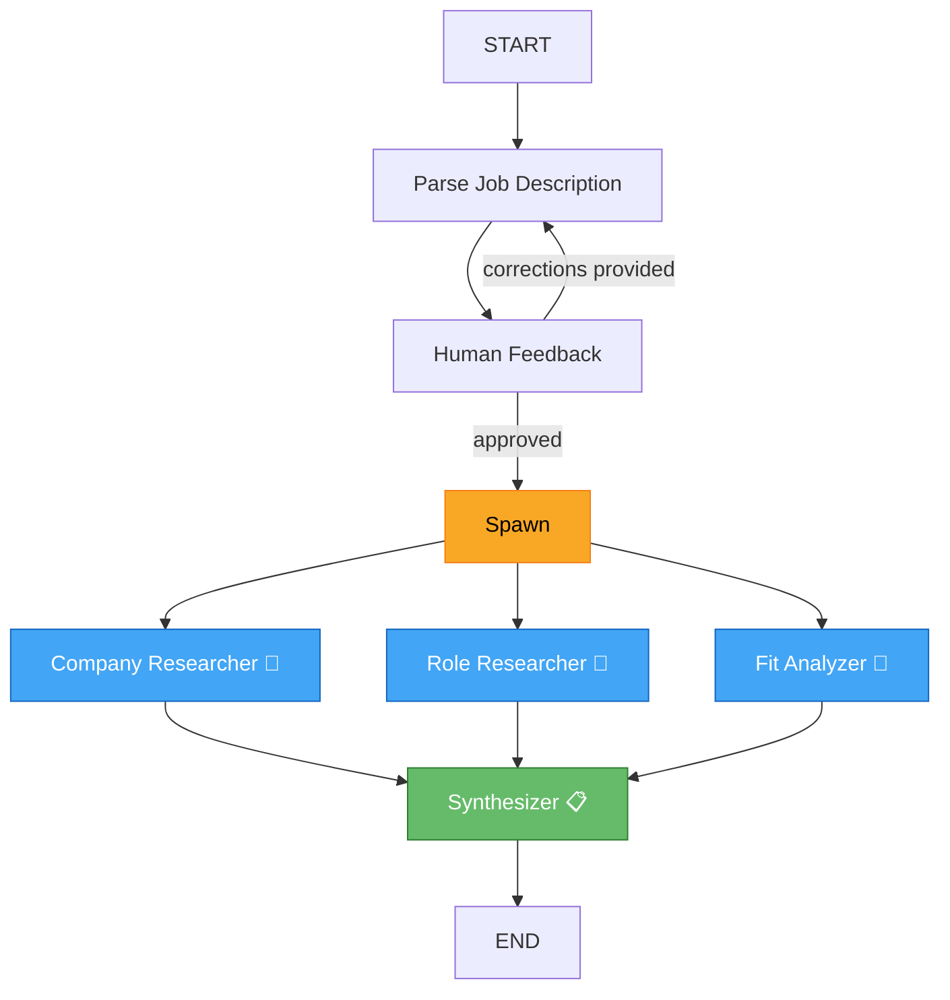

<p align="center">
  <h1 align="center">🔍 RoleScout</h1>
  <p align="center">
    <strong>AI-Powered Job Fit Analysis — Know Before You Apply</strong>
  </p>
  <p align="center">
    <a href="#features">Features</a> •
    <a href="#architecture">Architecture</a> •
    <a href="#tech-stack">Tech Stack</a> •
    <a href="#getting-started">Getting Started</a> •
    <a href="#deployment">Deployment</a>
  </p>
</p>

---

**RoleScout** is a multi-agent AI system that analyzes job descriptions, researches companies in real-time, evaluates your fit as a candidate, and generates a comprehensive interview prep report — all in under a minute.

Paste a job description, tell RoleScout about yourself, and get an honest assessment of whether you should apply, what to prepare, and what questions to expect.

## Features

| Feature | Description |
|---|---|
| 🧠 **JD Parsing** | Extracts company, role, seniority, skills, and hiring red/green flags from raw job descriptions |
| 🔄 **Human-in-the-Loop** | Review the parsed JD and provide corrections before analysis proceeds |
| 🏢 **Company Research** | Live web search for company culture, tech stack, recent news, funding, layoffs, and Glassdoor reviews |
| 💼 **Role Research** | Researches actual day-to-day responsibilities, salary benchmarks, interview formats, and demand trends |
| 🎯 **Fit Analysis** | Compares your profile against JD requirements with conservative, honest scoring (1–10) |
| 📋 **Synthesis Report** | Generates a structured report: Company Snapshot, Role Reality Check, Your Fit, Interview Prep, and Bottom Line |
| ⚡ **Parallel Execution** | Company, Role, and Fit agents run simultaneously via LangGraph's `Send` API |
| 🔐 **API Key Auth** | Simple but effective API key authentication on all endpoints |

## Architecture

RoleScout uses a **stateful multi-agent graph** built with [LangGraph](https://github.com/langchain-ai/langgraph). The graph orchestrates five specialized agents with human-in-the-loop feedback and parallel execution.



### Agent Details

| Agent | Type | Tools | Output Schema |
|---|---|---|---|
| **JD Parser** | Structured output | None | `JDParserOutput` — company, role, seniority, skills, flags |
| **Company Researcher** | ReAct agent | `web_search`, `search_news` | `CompanyResearcher` — culture, tech stack, news, red flags |
| **Role Researcher** | ReAct agent | `web_search`, `search_news` | `RoleResearcher` — responsibilities, salary, interview format |
| **Fit Analyzer** | Structured output | None (reads state) | `FitAnalyzer` — score, matches, gaps, talking points |
| **Synthesizer** | Free-form LLM | None | Final markdown report |

### Key Design Decisions

- **Parallel fan-out**: After human approval, three agents run simultaneously using LangGraph's `Send` primitive, reducing latency by ~3x compared to sequential execution
- **State reducer**: Results from parallel agents are merged via `operator.add` on a shared `results` list — no overwrites, no race conditions
- **Human-in-the-loop**: The graph interrupts before the feedback node, allowing the user to correct the parsed JD before expensive research begins
- **Checkpointing**: SQLite-based checkpointer enables resuming interrupted graph runs (critical for the two-step analyze → resume flow)

## Tech Stack

### Backend
| Technology | Purpose |
|---|---|
| **FastAPI** | REST API framework with async support |
| **LangGraph** | Multi-agent orchestration with state management |
| **LangChain** | LLM abstractions, structured output, tool binding |
| **OpenRouter** | LLM provider (Nvidia Nemotron 3 Super 120B) |
| **DuckDuckGo Search** | Real-time web and news search (no API key required) |
| **Pydantic** | Schema validation for all agent inputs/outputs |
| **SQLite** | Graph state checkpointing |

### Frontend
| Technology | Purpose |
|---|---|
| **React 19** | UI framework |
| **TypeScript** | Type safety |
| **Tailwind CSS 4** | Utility-first styling |
| **React Router 7** | Client-side routing |
| **React Markdown** | Rendering the final report |
| **Vite 8** | Build tool and dev server |

### Infrastructure
| Technology | Purpose |
|---|---|
| **Docker** | Containerized backend (Python) and frontend (nginx) |
| **Docker Compose** | Local multi-service orchestration |
| **Railway** | Cloud deployment (separate frontend + backend services) |
| **nginx** | Static file serving + SPA fallback routing |

## Project Structure

```
RoleScout/
├── backend/
│   ├── app/
│   │   ├── agents/              # AI agent implementations
│   │   │   ├── parser.py        # JD parsing + human feedback routing
│   │   │   ├── company.py       # Company research (ReAct loop)
│   │   │   ├── role.py          # Role research (ReAct loop)
│   │   │   ├── fit.py           # Candidate fit evaluation
│   │   │   └── synthesizer.py   # Final report generation
│   │   ├── graph/
│   │   │   └── orchestration.py # LangGraph state machine definition
│   │   ├── schemas/             # Pydantic models
│   │   │   ├── jd.py            # JD parser output schema
│   │   │   ├── profile.py       # Candidate profile schema
│   │   │   ├── research.py      # Research agent output schemas
│   │   │   └── state.py         # Graph shared state
│   │   ├── tools/
│   │   │   └── search.py        # DuckDuckGo web + news search
│   │   ├── config.py            # LLM and environment config
│   │   ├── main.py              # FastAPI app, CORS, auth, endpoints
│   │   └── schema.py            # API request/response models
│   ├── Dockerfile
│   └── requirements.txt
├── frontend/
│   ├── src/
│   │   ├── pages/
│   │   │   ├── ProfilePage.tsx  # Candidate profile input form
│   │   │   ├── AnalyzePage.tsx  # JD input, parsing, feedback, analysis
│   │   │   └── ReportPage.tsx   # Final report display
│   │   ├── api.ts               # Backend API client
│   │   ├── types.ts             # TypeScript interfaces
│   │   ├── storage.ts           # Local storage persistence
│   │   ├── App.tsx              # Router and layout
│   │   └── main.tsx             # React entry point
│   ├── nginx.conf               # Production nginx config
│   └── Dockerfile
└── docker-compose.yml           # Local development setup
```

## Getting Started

### Prerequisites

- Python 3.11+
- Node.js 20+
- An [OpenRouter](https://openrouter.ai/) API key

### 1. Clone the Repository

```bash
git clone https://github.com/YOUR_USERNAME/RoleScout.git
cd RoleScout
```

### 2. Backend Setup

```bash
cd backend

# Create virtual environment
python -m venv .venv
source .venv/bin/activate   # Windows: .venv\Scripts\activate

# Install dependencies
pip install -r requirements.txt

# Configure environment
cp .env.example .env
# Edit .env with your API keys
```

### 3. Frontend Setup

```bash
cd frontend

npm install

# Configure environment
cp .env.example .env
# Edit .env with your backend URL
```

### 4. Run Locally

**Option A: Docker Compose (recommended)**
```bash
docker compose up --build
```
- Frontend: http://localhost:80
- Backend: http://localhost:8000

**Option B: Manual**
```bash
# Terminal 1 — Backend
cd backend
uvicorn app.main:app --reload --port 8000

# Terminal 2 — Frontend
cd frontend
npm run dev
```

## API Reference

### `POST /analyze`

Parses a job description and returns structured data for human review.

**Headers:** `X-API-Key: <your-api-key>`

**Request:**
```json
{
  "job_desc": "We are hiring a Senior Backend Engineer at Stripe...",
  "profile": {
    "name": "Jane Doe",
    "skills": {
      "hard_skills": [{"name": "Python", "proficiency": 9}],
      "soft_skills": [{"name": "Communication", "proficiency": 8}]
    },
    "experience_years": 5,
    "projects": [
      {
        "name": "Payment Gateway",
        "tech_stack": ["Python", "FastAPI", "PostgreSQL"],
        "deployment_status": "production"
      }
    ],
    "preferred_roles": ["Backend Engineer", "Platform Engineer"],
    "location": "San Francisco, CA"
  }
}
```

**Response:**
```json
{
  "thread_id": "abc-123",
  "parsed_jd": {
    "company_name": "Stripe",
    "role_title": "Senior Backend Engineer",
    "seniority_level": "Senior",
    "required_skills": { "hard_skills": [...], "soft_skills": [...] },
    "flags": [{ "flag_type": "Green", "desc": "Clear technical expectations" }]
  }
}
```

### `POST /analyze/resume`

Resumes analysis after human feedback. Triggers parallel research and returns the final report.

**Request:**
```json
{
  "thread_id": "abc-123",
  "feedback": null
}
```

**Response:**
```json
{
  "final_report": "## Company Snapshot\n\nStripe is a..."
}
```

## Deployment

### Railway

1. Create a new project on [Railway](https://railway.com/)
2. Add two services from your GitHub repo:
   - **Backend** — root directory: `backend/`
   - **Frontend** — root directory: `frontend/`
3. Generate public domains for both services
4. Set environment variables:

| Service | Variable | Value |
|---|---|---|
| Backend | `OPENROUTER_API_KEY` | Your OpenRouter key |
| Backend | `API_KEY` | Any secure random string |
| Backend | `CORS_ORIGINS` | `https://your-frontend.up.railway.app` |
| Frontend | `VITE_API_URL` | `https://your-backend.up.railway.app` |
| Frontend | `VITE_API_KEY` | Same as backend `API_KEY` |

5. Set the frontend service port to **80** (Settings → Networking)
6. Deploy 🚀

## How It Works — User Flow

```
1. Profile Page     → Fill in your skills, projects, experience
2. Analyze Page     → Paste a job description → AI parses it
3. Human Review     → Check the parsed JD → approve or correct
4. Research Phase   → 3 agents run in parallel (Company, Role, Fit)
5. Report Page      → Read your personalized analysis report
```

## Environment Variables

Create `.env.example` files for reference (actual `.env` files are gitignored):

### Backend (`backend/.env.example`)
```env
OPENROUTER_API_KEY=sk-or-v1-your-key-here
API_KEY=generate-a-secure-random-string
CORS_ORIGINS=*
```

### Frontend (`frontend/.env.example`)
```env
VITE_API_URL=http://localhost:8000
VITE_API_KEY=same-as-backend-api-key
```

## License

This project is licensed under the Apache License 2.0 — see the [LICENSE](LICENSE) file for details.

---

<p align="center">
  Built with ❤️ using LangGraph, FastAPI, and React
</p>
